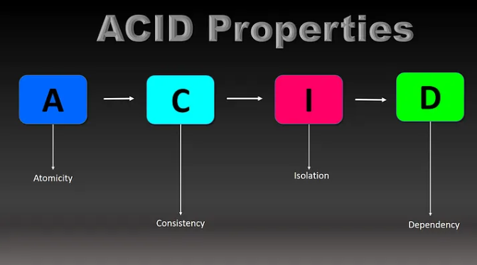

# ACID TRANSACTIONS
ACID transactions ensure that database transactions are reliable and consistent, even in the face of errors, power failures, or other problems. 

`The acronym ACID stands for atomicity, consistency, isolation, and durability.`

## What Are Transactions in DBMS?
A transaction in DBMS refers to a sequence of operations performed as a single unit of work. 

These operations may involve reading or writing data to the database. To maintain data integrity, DBMS ensures that each transaction adheres to the ACID properties.

### Transaction Lifespan
* Transaction BEGIN: A transaction always starts with the BEGIN keyword. This indicated to the database that it was about to start a transaction with multiple queries in it.

* Transaction COMMIT: Every time a transaction is written, it does not persist in the database unless it has been committed hence the transaction COMMIT which commits all the queries from when the queries begin and persist in the database.

* Transaction ROLLBACK: This helps you undo changes or queries written. Let’s assume you got a crash in the middle of your transaction after writing ten thousand queries, then this becomes very important to ROLLBACK and retrieves those queries.

### Nature of transaction
Usually, transactions are used to change and modify data, however, it is perfectly normal to have a read-only transaction example you want to generate a report and you want to get a consistent snapshot based on the time of transaction.

## The Four ACID Properties

### Atomicity: "All or Nothing"
Atomicity ensures that a transaction is atomic, it means that either the entire transaction completes fully or doesn't execute at all. 

There is no in-between state i.e. transactions do not occur partially. If a transaction has multiple operations, and one of them fails, the whole transaction is rolled back, leaving the database unchanged. 

This avoids partial updates that can lead to inconsistency.

* Commit: If the transaction is successful, the changes are permanently applied.

* Abort/Rollback: If the transaction fails, any changes made during the transaction are discarded.

### Consistency: Maintaining Valid Data States
Consistency ensures that a database remains in a valid state before and after a transaction. 

It guarantees that any transaction will take the database from one consistent state to another, maintaining the rules and constraints defined for the data. 

In simple terms, a transaction should only take the database from one valid state to another. 

If a transaction violates any database rules or constraints, it should be rejected, ensuring that only consistent data exists after the transaction.

#### Consistency in data
This represented the state that actually persisted in the data. This mainly involves enforcing.

* foreign keys referential integrity between two tables or documents an example can be seen when creating a user-like system, when a user(s) like an image or blog, the blog or image should persist the actual number of likes it has got from the user table.

* atomicity – data should persist across the database.

* Isolation – based on the isolation level which we will talk about later should return correct reads from two concurrent parallel tables.

#### Consistency in reads
For example, you have a database, you update a value X in the database, and now the next read must give you value X. That is what consistency in reading means. If a transaction committed a change will a new transaction immediately see the change? when this does not work we get an inconsistent database. This affects the system as a whole. 

### Isolation: Ensuring Concurrent Transactions Don't Interfere
This property ensures that multiple transactions can occur concurrently without leading to the inconsistency of the database state. Transactions occur independently without interference. Changes occurring in a particular transaction will not be visible to any other transaction until that particular change in that transaction is written to memory or has been committed.

This property ensures that when multiple transactions run at the same time, the result will be the same as if they were run one after another in a specific order. This property prevents issues such as dirty reads (reading uncommitted data), non-repeatable reads (data changing between two reads in a transaction), and phantom reads (new rows appearing in a result set after the transaction starts).

#### Database implementation of isolation
Each DBMS implements the Isolation level differently.

* Pessimistic Approach – Row level locks, table locks, and page locks to avoid lost updates.

* Optimistic Approach – No locks, just track if things changed and fail the transaction if so
Repeatable read “locks” the rows it reads but it could be expensive if you read a lot of rows. Postgres implements Repeated read as a snapshot. That is why you do not get phantom reads with postgres.
Serializable is usually implemented with optimistic concurrency control.

### Durability: Persisting Changes
This property ensures that once the transaction has completed execution, the updates and modifications to the database are stored in and written to disk and they persist even if a system failure occurs. These updates now become permanent and are stored in non-volatile memory. In the event of a failure, the DBMS can recover the database to the state it was in after the last committed transaction, ensuring that no data is lost.

Example: After successfully transferring money from Account A to Account B, the changes are stored on disk. Even if there is a crash immediately after the commit, the transfer details will still be intact when the system recovers, ensuring durability.

### How ACID Properties Impact DBMS Design and Operation

* Data Integrity and Consistency

ACID properties safeguard the data integrity of a DBMS by ensuring that transactions either complete successfully or leave no trace if interrupted. They prevent partial updates from corrupting the data and ensure that the database transitions only between valid states.

* Concurrency Control
ACID properties provide a solid framework for managing concurrent transactions. Isolation ensures that transactions do not interfere with each other, preventing data anomalies such as lost updates, temporary inconsistency, and uncommitted data.

* Recovery and Fault Tolerance
Durability ensures that even if a system crashes, the database can recover to a consistent state. Thanks to the Atomicity and Durability properties, if a transaction fails midway, the database remains in a consistent state.

| Property   | Responsibility for maintaining properties |
|------------|-------------------------------------------|
| Atomicity  |  Transaction Manager           |
| Consistency |	Application programmer    |
| Isolation	  | Concurrency Control Manager |
| Durability|	Recovery |

### Advantages of ACID Properties in DBMS
* Data Consistency: ACID properties ensure that the data remains consistent and accurate after any transaction execution.

* Data Integrity: It maintains the integrity of the data by ensuring that any changes to the database are permanent and cannot be lost.

* Concurrency Control: ACID properties help to manage multiple transactions occurring concurrently by preventing interference between them.

* Recovery: ACID properties ensure that in case of any failure or crash, the system can recover the data up to the point of failure or crash.

### Disadvantages of ACID Properties in DBMS
* Performance Overhead: ACID properties can introduce performance costs, especially when enforcing isolation between transactions or ensuring atomicity.

* Complexity: Maintaining ACID properties in distributed systems (like microservices or cloud environments) can be complex and may require sophisticated solutions like distributed locking or transaction coordination.

* Scalability Issues: ACID properties can pose scalability challenges, particularly in systems with high transaction volumes, where traditional relational databases may struggle under load.

### ACID in the Real World: Where Is It Used?
In modern applications, ensuring the reliability and consistency of data is crucial. ACID properties are fundamental in sectors like:

* Banking: Transactions involving money transfers, deposits, or withdrawals must maintain strict consistency and durability to prevent errors and fraud.

* E-commerce: Ensuring that inventory counts, orders, and customer details are handled correctly and consistently, even during high traffic, requires ACID compliance.

* Healthcare: Patient records, test results, and prescriptions must adhere to strict consistency, integrity, and security standards.
