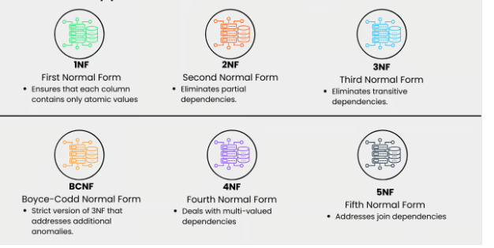

# NORMALIZATION IN POSTGRESQL

## What is Normalization
Normalization is the process of `organizing data` within a database (relational database) to eliminate data anomalies, such as redundancy.

Data redundancy unnecessarily increases the size of the database as the same data is repeated in many places. Inconsistency problems also arise during insert, delete, and update operations

It involves breaking down a large, complex table into smaller and simpler tables while maintaining data relationships.

It is commonly used when dealing with large datasets.

## Why is Normalization  Important?
-Reduces redundancy: Redundancy is when the same information is stored multiple times, and a good way of avoiding this is by splitting data into smaller tables.

-Improves query performance: You can perform faster query execution on smaller tables that have undergone normalization.

-Minimizes update anomalies: With normalized tables, you can easily update data without affecting other records.
Enhances data integrity: It ensures that data remains consistent and accurate.

## Different Types of Database Normalization

### First Normal Form (1NF)

A relation is in first normal form if every attribute in that relation is single-valued attribute. 

This normalization level ensures that each column in your data contains only atomic values. Atomic values in this context means that each entry in a column is indivisible. 

It is like saying that each cell in a spreadsheet should hold just one piece of information. 1NF ensures atomicity of data, with each column cell containing only a single value and each column having unique names.

### Second Normal Form (2NF)
A relation that is in First Normal Form and every non-primary-key attribute is fully functionally dependent on the primary key, then the relation is in Second Normal Form (2NF).

It Eliminates partial dependencies by ensuring that non-key attributes depend only on the primary key. `What this means, in essence, is that there should be a direct relationship between each column and the primary key, and not between other columns`

 ### Third Normal Form (3NF)
Removes transitive dependencies by ensuring that non-key attributes depend only on the primary key. This level of normalization builds on 2NF.

A relation is in the third normal form, if there is no transitive dependency for non-prime attributes as well as it is in the second normal form. A relation is in 3NF if at least one of the following conditions holds in every non-trivial function dependency X –> Y.

`X is a super key`

`Y is a prime attribute (each element of Y is part of some candidate key)`.

### Boyce-Codd Normal Form (BCNF)
This is a more strict version of 3NF that addresses additional anomalies. At this normalization level, every determinant is a candidate key.

relation should satisfy the below conditions

`The relation should be in the 3rd Normal Form`

`X should be a super-key for every functional dependency (FD) X−>Y in a given relation `

### Fourth Normal Form (4NF)
This is a normalization level that builds on BCNF by dealing with multi-valued dependencies.

A relation R is in 4NF if and only if the following conditions are satisfied: 

`It should be in the Boyce-Codd Normal Form (BCNF)`

`The table should not have any Multi-valued Dependency`

 ### Fifth Normal Form (5NF)
5NF is the highest normalization level that addresses join dependencies. It is used in specific scenarios to further minimize redundancy by breaking a table into smaller tables.

relation R is in 5NF if and only if it satisfies the following conditions:

`R should be already in 4NF`

`It cannot be further non loss decomposed (join dependency)`

## Advantages of Normalization

* Normalization eliminates data redundancy and ensures that each piece of data is stored in only one place, reducing the risk of data inconsistency and making it easier to maintain data accuracy.

* By breaking down data into smaller, more specific tables, normalization helps ensure that each table stores only relevant data, which improves the overall data integrity of the database.

* Normalization simplifies the process of updating data, as it only needs to be changed in one place rather than in multiple places throughout the database.

* Normalization enables users to query the database using a variety of different criteria, as the data is organized into smaller, more specific tables that can be joined together as needed.

* Normalization can help ensure that data is consistent across different applications that use the same database, making it easier to integrate different applications and ensuring that all users have access to accurate and consistent data.

## Disadvantages of Normalization

* Normalization can result in increased performance overhead due to the need for additional join operations and the potential for slower query execution times.

* Normalization can result in the loss of data context, as data may be split across multiple tables and require additional joins to retrieve.

* Proper implementation of normalization requires expert knowledge of database design and the normalization process. 

* Normalization can increase the complexity of a database design, especially if the data model is not well understood or if the normalization process is not carried out correctly.

